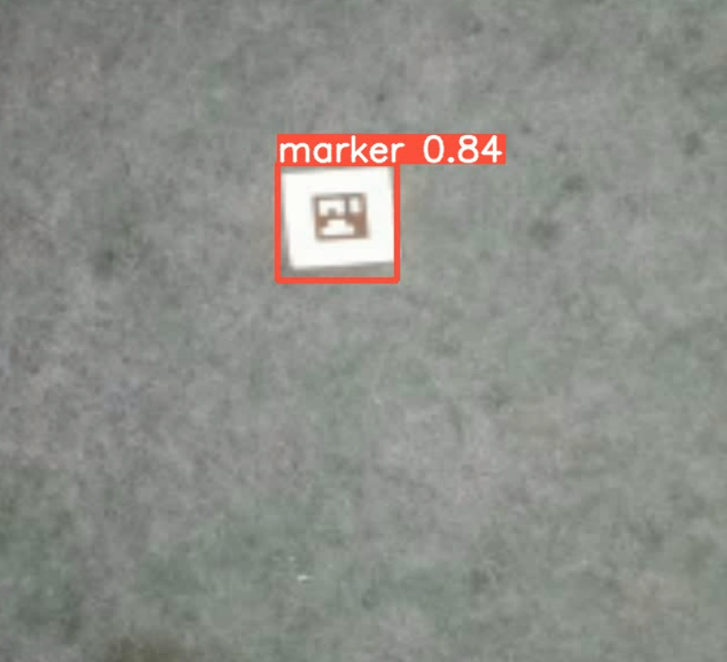

# Marker Detection For Autonomous Landing Of UAVs

# Overview
This project is dedicated to creating a reliable marker detection system for the autonomous landing of Unmanned Aerial Vehicles (UAVs). By leveraging advanced deep learning models, particularly YOLOv5, the system is designed to recognize markers in scenes captured by drones flying at various altitudes. The primary objective is to improve the accuracy of autonomous landings, especially in situations where GPS signals are weak or unavailable.

## Table of Contents
- [Introduction](#introduction)
- [Dataset](#dataset)
- [Methodology](#methodology)
- [Model Training and Performance](#model-training-and-performance)
- [Real-Time Testing](#real-time-testing)
- [Future Directions](#future-directions)
- [How to Contribute](#how-to-contribute)

## Introduction
Autonomous landing in areas where GPS signals are compromised poses a significant challenge in modern UAV operations. This project tackles this issue by employing deep learning methods along with low-cost, low-resolution cameras to detect landing markers, thus enabling UAVs to land with greater precision and reliability.

## Dataset
This project utilizes the TDMBSD dataset, which is tailored for marker detection in UAV landing contexts. The dataset comprises 7,519 high-resolution images taken at various heights, providing a solid foundation for both training and testing the detection models.

## Methodology
The approach for marker detection and UAV autonomous landing is based on a systematic framework:

- **Data Acquisition and Labeling:** A total of 7,519 images were captured by drones at altitudes between 5 to 50 meters, with annotations performed using the LabelImg tool.
- **Model Development:** YOLOv5 was chosen due to its excellent balance of speed and accuracy. The model was trained over 300 epochs on the labeled dataset, resulting in high detection accuracy.
- **Hyperparameter Adjustment:** The model’s performance was further refined through iterative optimization of its hyperparameters.
- **Real-Time Implementation:** The trained model was integrated and tested in real-time conditions, with a focus on deployment in edge computing environments using Raspberry Pi.

## Model Training and Performance
Extensive training of the YOLOv5 model yielded the following results:

- **Detection Accuracy:** Achieved a 75.965% success rate in detecting markers.
- **Precision:** Attained 99.544 mAP metrics precision at an Intersection over Union (IoU) threshold of 0.6.
- **Recall:** Achieved a 99.925 mAP metrics recall at an IoU threshold of 0.6.
- **F1-Score:** The model reached an F1-Score of 0.99734, reflecting its balanced performance in precision and recall.

  
## Real-Time Testing
Real-time testing was conducted to evaluate the performance of the trained model in live scenarios. Below is an image demonstrating the **real-time detection** and **marker recognition** in action during an autonomous landing test:

(./Results/Realtime2.png)

The model was deployed on a Raspberry Pi, where it processed real-time video streams from a low-cost camera mounted on the UAV. The image above shows how the model identifies the landing marker, guiding the UAV to its target location.

## Future Directions
Future work will focus on:

- Enhancing detection accuracy under different environmental conditions.
- Incorporating advanced edge computing techniques to improve real-time performance.
- Expanding the dataset to include a wider variety of scenarios.

## How to Contribute
We welcome contributions to this project. If you're interested in collaborating or have suggestions for improvement, please submit a pull request or open an issue on GitHub.
