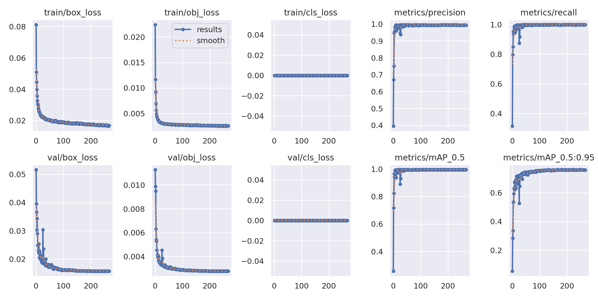
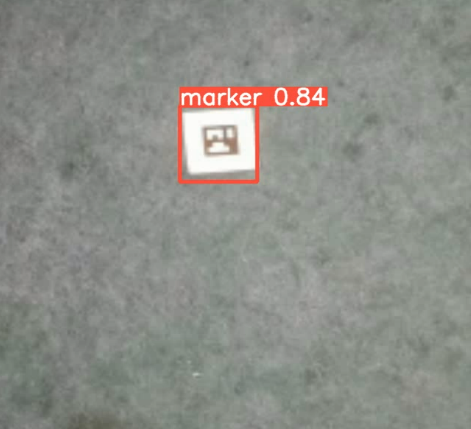
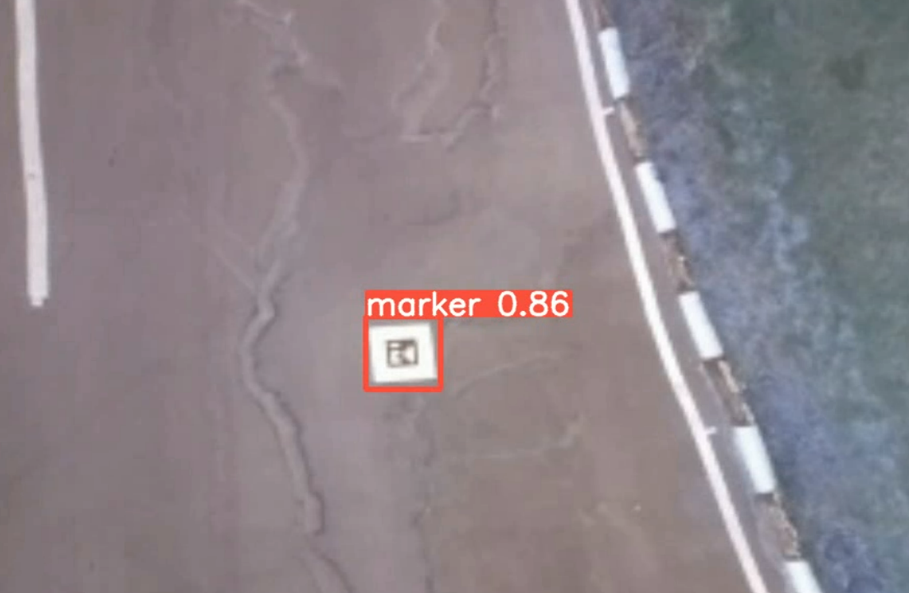

# Marker Detection For Autonomous Landing Of UAVs

## Overview
This project presents a complete, vision-based system for the **autonomous landing of Unmanned Aerial Vehicles (UAVs)** in environments where GPS signals are degraded, unavailable, or unreliable. 

Traditional precision landing systems rely heavily on expensive, high-resolution cameras and heavy onboard computers. This project solves that by utilizing a low-cost, low-resolution camera paired with a **Raspberry Pi edge-computing module**. By running a highly optimized YOLOv5 deep learning model, the drone can identify ArUco landing markers in real-time and execute continuous flight path corrections, achieving a precision touchdown with an accuracy of up to 5 cm.

## Table of Contents
- [Key Features](#key-features)
- [System Architecture & Control Flow](#system-architecture--control-flow)
- [The Landing Protocol](#the-landing-protocol)
- [Model Training & Methodology](#model-training--methodology)
- [Real-Time Execution & Results](#real-time-execution--results)
- [Future Directions](#future-directions)

---

## Key Features
* **GPS-Denied Precision Landing:** Guarantees safe and accurate drone landings solely using visual feedback, overcoming the limitations of standard GPS-based navigation.
* **Real-Time Edge Processing:** Eliminates the need for heavy onboard processing by deploying the detection model directly onto a lightweight Raspberry Pi.
* **Dynamic Altitude Tracking:** Capable of detecting the landing marker from altitudes as high as 50 meters down to the final touchdown phase.
* **Iterative Trajectory Correction:** Implements a closed-loop control system that continuously adjusts the drone's North/East position and altitude during descent.

---

## System Architecture & Control Flow
The system operates on a continuous feedback loop between the drone's flight controller and the onboard edge computing unit. 

1. **Initialization & Communication:** The system establishes an IP connection with the drone. If synchronization fails, it enters a retry loop until communication is stable.
2. **Waypoint Navigation:** The armed UAV is directed along a predefined path to its general target area.
3. **Return to Launch (RTL) & Scan:** The system triggers an RTL command while simultaneously engaging the camera to search for the landing pad marker.
4. **Target Acquisition:** 
   * If the marker is *not* detected, the drone loops back to retry the approach.
   * If the marker *is* detected, the system overrides standard navigation and initiates the autonomous vision-based descent.

---

## The Landing Protocol
Achieving a 5 cm landing accuracy requires more than just detecting a marker; it requires dynamic flight adjustments. Once the marker is acquired, the UAV executes a **three-phase descent strategy**:

1. **Initial Approach (~7.1 meters):** The drone detects the marker, centers itself roughly over the target, and begins a controlled descent.
2. **Secondary Adjustment (~5.0 meters):** As the marker grows larger in the camera's field of view, the system recalculates its position and makes finer horizontal adjustments.
3. **Final Fine-Tuning (~2.3 meters):** The drone makes its final micro-adjustments to its pitch and roll to ensure it is perfectly aligned before cutting power for touchdown.

---

## Model Training & Methodology
To ensure the drone could recognize the landing pad under various environmental conditions, a YOLOv5 object detection model was trained specifically for aerial marker recognition.

* **Training Data:** The model was trained on a specialized drone-captured dataset featuring over 7,500 images across different altitudes (5m to 50m), lighting conditions (morning, daylight, evening), and camera ISO settings.
* **Hardware:** Model training was accelerated using an NVIDIA RTX A5000 GPU and AMD Ryzen 9 5900X CPU.
* **Performance Metrics:** At an Intersection over Union (IoU) threshold of 0.6, the model achieved exceptional reliability for real-world deployment:
  * **Precision (mAP):** 99.544%
  * **Recall (mAP):** 99.925%
  * **F1-Score:** 0.99734

  

---

## Real-Time Execution & Results
During live flight tests, the edge-computing module processed real-time video streams from the drone. The system successfully demonstrated dynamic adaptation, consistently locking onto the marker despite vibrations, changing sunlight, and descending altitude.

### Real-Time Detection
Below are examples of the drone's camera feed actively locking onto the landing marker during the descent phase:

  
  

### Altitude Tracking
The model proved highly robust at tracking the marker from high altitudes down to the ground.

  

---

## Future Directions
Future development of this autonomous landing system will focus on:
* **Complex Environmental Adaptation:** Upgrading the vision pipeline (potentially testing YOLOv11) for highly cluttered operational environments or moving landing platforms (e.g., naval vessels).
* **Sensor Fusion Integration:** Incorporating LiDAR for precise 3D spatial awareness and Radar to allow for autonomous landings in fog, heavy rain, or complete darkness.